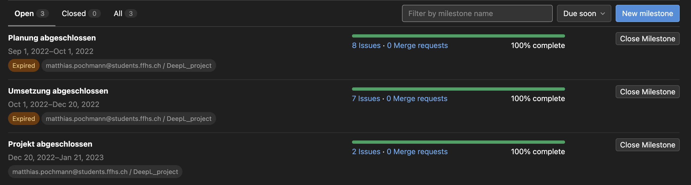
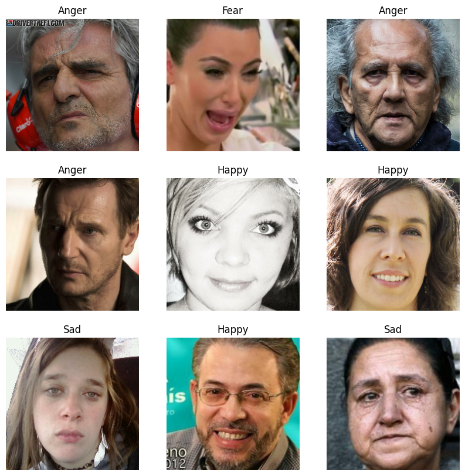
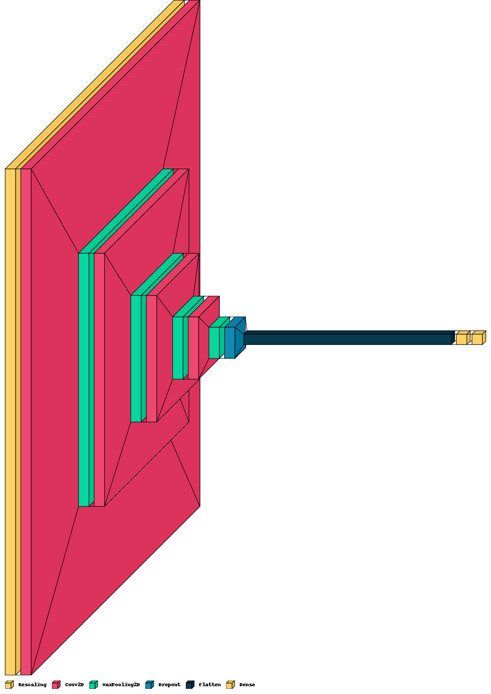
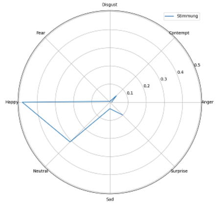

# ReFaX - Real Time Facial Expression Detection

Dieses Projekt wurde im Rahmen des DeepL (Deep Learning) Kurses an der FFHS entwickelt.

Autoren:
- Bischof, Marc
- Hostettler, Luca
- Pochmann, Matthias


## Projektorganisation

Die Projektorganisation erfolgte mit GitLab.
Wir haben pro Task ein Issue erstellt und diesen einem Milestone zugeordnet.

Die Issues wurden in 3 Kategorien unterteilt:
- Planung (8 Issues)
- Umsetzung (7 Issues)
- Abschluss (2 Issues)

Link zum GitLab Board: [GitLab Board](https://git.ffhs.ch/matthias.pochmann/deepl_project/-/boards)



### Ordnerstruktur

Die Ordnerstruktur ist wie folgt aufgebaut:
```
./pythonProject
    ./notebooks
        ./10_Data_Preparation.ipynb
        ./20_Train_Model.ipynb
        ./30_Test_Model.ipynb
        ./99_Model_Architecture.ipynb
        ./diagrams
    ./models
        ./myModel.h5
    ./moduls
        ./game
        ./handdetection
    ./app.py

```

## Einleitung

Das Projekt ReFaX (Real Time Facial Expression Detection) ist ein Programm, welches in Echtzeit die Gesichtsausdrücke von Personen erkennt. 
Die Erkennung erfolgt mittels eines neuronalen Netzes, welches selbst erstellt und trainiert wurde. 

Das Programm ist in Python geschrieben und nutzt die Bibliothek OpenCV zur Bildverarbeitung.

## Daten

Die Daten für das Training basieren auf [AffectNet Arxiv Link](https://https://arxiv.org/abs/1708.03985)

Es beinhaltet 8 Klassen (Neutral, Happiness, Sadness, Surprise, Fear, Disgust, Anger, Contempt) und 287'651 Training und 4'000 Test Bilder.

Die Daten innerhalb der Klassen sind ungleichmässig verteilt. 'Happy' und 'Neutral' sind am häufigsten vertreten, 'Contempt' am seltensten.

Ein Beispiel für jedes Label:


## Architektur

Die Architektur unseres Modells ist ein Convolutional Neural Network (CNN).

Es besteht aus 1 Rescaling Layer, 4 Convolutional Layers je 1 Max Pooling Layers und am Schluss Dropout, Flatten + 2 Dense.



### Konfiguration

Als Aktivierungsfunktion wurde `reLu` verwendet. Die Optimierung erfolgte mit `Adam` und die Loss-Funktion mit `Sparse Categorical Crossentropy`.

### Data Augmentation

Mit `keras.Sequential` haben wir einen weiteren Layer erstellt, für die Data Augmentation. 

Die Schritte in diesem Layer sind:
- RandomFlip (Horizontal)
- RandomRotation
- Zoom

### Training

Das Training fand 20 Epochen lang statt. Die Batch-Size betrug 32.

## Resultate

Als höchste Accuracy mit der Data Augmentation haben wir als maximale Accuracy von 8 Klassen 0.43 erreicht.

Dieses Resultat ist im Vergleich zu den State of The Art Resultaten gar nicht sehr schlecht.
Die State of the Art Resultate bei 8 Klassen hat `Multi-Task EffiecientNet-B2` mit 0.63 erreicht.

## Explainablity

Um die Erkennung der einzelnen Klassen zu verstehen und darzustellen haben wir ein Spider-Chart erstellt.

Dieses Spider-Chart zeigt die Wahrscheinlichkeit der einzelnen Klassen in einem Kreis.



## Spiel

Das Spiel wurde ebenfalls mit Python entwickelt. Es verwendet zusätzlich die Library `MediaPipe` für das Erkennen und Tracken von Handgestiken verwendet.

Per Handgestik lässt sich das Spiel starten, wenn der Zeigefinger auf die Start-Taste zeigt.

## Demo

Hier ein Video zur Demo von ReFax

<figure class="video_container">
<iframe src="https://ffhs-my.sharepoint.com/personal/luca_hostettler_students_ffhs_ch/_layouts/15/embed.aspx?UniqueId=82871858-d776-4f97-b2be-26a4c45fc583&embed=%7B%22ust%22%3Atrue%2C%22hv%22%3A%22CopyEmbedCode%22%7D&referrer=OneUpFileViewer&referrerScenario=EmbedDialog.Create" width="640" height="360" frameborder="0" scrolling="no" allowfullscreen title="DeepL - ReFaX Demo-20230108_145642-Meeting Recording.mp4"></iframe>
</figure>
